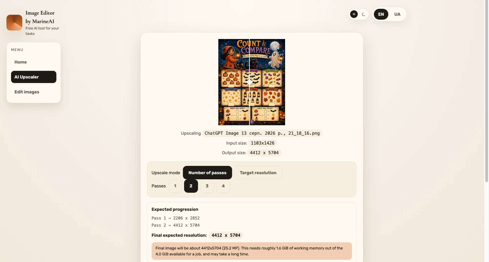
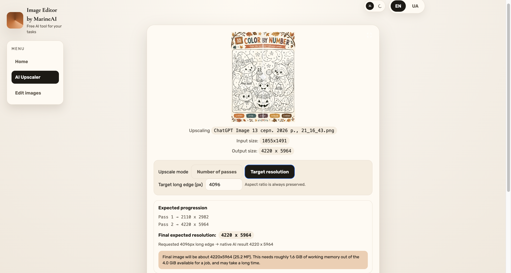

# 🎬 AI Image & Video Upscaler

Upscale images and video with AI **entirely in your browser**. No uploads, no sign-ups, no
installs — your files never leave your device. Powered by WebGPU and the
[Anime4K](https://github.com/bloc97/Anime4K) super-resolution networks.

✨ **What's here:** multi-pass upscaling, batch and folder processing, and one-click PDF export.

---

## 📸 Screenshots

### 1️⃣ Number of passes

Pick 1–4 passes and see the exact per-pass progression before anything runs. Here a
1103 × 1426 worksheet becomes 4412 × 5704 in two native 2× passes:



### 2️⃣ Target resolution

Or just say how big you want it. The app picks the fewest native passes that reach your
target and tells you the real result instead of silently resampling — here 4096 px was
requested and 4220 × 5964 is what the model actually produces:



Note the honest reporting in both: **pixel dimensions and memory cost**, never claims like
"true 4K quality".

---

## 🙏 Acknowledgements

This project is built on the excellent open-source work of
**[Samrat Bhattacharyya](https://github.com/sb2702)**.

* 🧠 [free-ai-video-upscaler](https://github.com/sb2702/free-ai-video-upscaler) — the original
  browser-based AI video upscaler this project extends
* ⚙️ [WebSR](https://github.com/sb2702/websr) — his SDK that ports AI super-resolution models
  such as Anime4K and Real-ESRGAN to WebGPU, and which does all the actual upscaling here

The original work is MIT licensed, and the entire upscaling engine is his. This repository adds
a multi-pass pipeline, batch/folder processing and PDF export on top of it. Huge thanks. 🙌

---

## 📑 Contents

* [Screenshots](#-screenshots)
* [Quick start](#-quick-start)
* [Multi-pass upscale](#-multi-pass-upscale)
* [Batch processing](#-batch-processing)
* [PDF export](#-pdf-export)
* [Safety limits](#-safety-limits-and-warnings)
* [Development](#-development)
* [Testing](#-testing)
* [Architecture](#-architecture)
* [Limitations](#-limitations)

---

## 🚀 Quick start

```bash
npm install
npm run serve
```

Then open <http://localhost:8080>.

🌐 **Requirements:** desktop **Chrome or Edge**. The tool needs WebGPU, WebCodecs and the
File System Access API. Everything runs locally — no server, no account, no telemetry.

| Command | What it does |
|---|---|
| `npm run serve` | 🔧 Dev server on :8080 |
| `npm run build` | 📦 Production bundle into `dist/` |
| `npm test` | ✅ Unit tests for planning/naming logic |
| `npm run type-check` | 🔍 `tsc --noEmit` |
| `npm run serve:test` | 🧪 Dev server + browser pipeline test page |

---

## 🔁 Multi-pass upscale

The shipped models (`anime4k/cnn-2x-s|m|l`) are **2× networks** — one pass doubles each
dimension. Multiple passes feed each pass's output straight back in as the next pass's input,
so you never download and re-upload intermediate files, and nothing is ever resampled between
passes.

### Mode 1️⃣ — Number of passes

Pick 1–4 and see exactly what you'll get **before** anything runs:

```
Original resolution:  1024 × 1024
Pass 1 → 2048 × 2048
Pass 2 → 4096 × 4096
Pass 3 → 8192 × 8192
Final expected resolution: 8192 × 8192
```

### Mode 2️⃣ — Target resolution

Type the long edge you want and the app works out the smallest number of native passes that
reaches it. Only the model's native 2× steps are used, so the result often isn't exactly the
number you typed — and the UI says so instead of silently resampling:

```
Requested 4000px long edge → native AI result 4096 × 4096
```

### 📐 Aspect ratio

Always preserved. Both axes get the same integer factor, so `1024 × 768` becomes
`4096 × 3072` — never `4096 × 4096`.

### ⚠️ Resolution is not quality

Those numbers are **pixel dimensions**. Upscaling a soft or heavily compressed source cannot
invent detail that was never captured, so the UI reports resolutions and pass counts — never
claims like "true 4K quality".

---

## 📂 Batch processing

Three input modes on the start screen:

| Mode | What it does |
|---|---|
| 📄 **Single file** | The original one-file flow |
| 🗂️ **Multiple files** | Pick several images/videos at once |
| 📁 **Folder** | Pick a directory; tick **Include subfolders** for recursion (off by default) |

✅ **Supported:** PNG, JPG, WebP images · MP4, MOV, M4V video
🚫 **Ignored:** everything else — `.txt`, `.json`, PDFs, `.DS_Store`, sub-folders when recursion
is off — listed under "Ignored files" rather than failing the scan.

The queue shows each file's type, original resolution, pass setting and expected output.
Settings are **global defaults + optional per-file overrides**: set "Apply to all" once, and
only change the rows you actually want different.

⏳ Files are processed **one at a time** — they share one GPU and one model cache, so running
them concurrently would multiply peak VRAM without being faster. Progress shows the overall
count, the current file and the current pass (or encode % for video).

🛟 **If one file fails**, it's marked `Failed` with the reason and the batch carries on. The
summary reports how many succeeded, failed or were cancelled. **Cancel batch** stops after the
current file finishes safely.

### 💾 Output

Folder input writes to `<chosen folder>/upscaled/`; other modes ask once for an output folder,
falling back to ordinary browser downloads if you decline. **Originals are never modified.**

Names state the real resolution, and existing files are never silently overwritten:

```
photo.png  →  photo_upscaled_4096x4096.png
clip.mp4   →  clip_upscaled_3840x2160.mp4
           →  photo_upscaled_4096x4096 (2).png   # if the name is taken
```

---

## 📕 PDF export

Tick **Create PDF from processed images** for an optional final step. Videos are still
upscaled — they're just never put in the PDF.

* 🔢 **Order** — natural filename order, so `page_2` comes before `page_10`
* 📏 **Page size** — one page per image, sized to that image's own pixel dimensions, so nothing
  is stretched or cropped. Pages beyond the PDF format's 14400pt limit have only their *page
  box* scaled; the embedded pixels are untouched
* 💎 **Quality** — *Maximum* embeds JPEGs byte-for-byte (zero recompression) and PNGs
  losslessly. *Balanced* re-encodes to JPEG for a much smaller file. PNGs over 40 MP are too
  large to embed losslessly in a browser tab, so *Maximum* falls back to JPEG q0.95 **and says
  so** — quality is never silently reduced

The filename defaults to `<folder>_upscaled.pdf` and is editable.

---

## 🛡️ Safety limits and warnings

Before running, a job is checked against two different things:

1. 🎛️ **Hard device limits** — `maxTextureDimension2D` and `maxStorageBufferBindingSize` as
   reported by your GPU.
2. 🧮 **Projected working memory** — because an advertised WebGPU maximum is *not* available
   memory. Every pass in a chain is held at once (each pass's model instance keeps its own
   intermediate buffers), plus the output canvas and encode buffers. The per-pixel cost is
   **measured** from the network's real allocations the first time it runs, not guessed.

The budget is half the memory the browser reports for the device. Risk escalates gradually:

| Example (1024×1024 source, 8 GB device) | Level |
|---|---|
| 1 pass → 2048×2048 (~0.3 GiB) | 🟢 quiet |
| 2 passes → 4096×4096 (~1.1 GiB) | 🟡 warning, still allowed |
| 3 passes → 8192×8192 (~4.5 GiB) | 🔴 **blocked**, Start disabled |

Blocked jobs always explain why in concrete terms — *"Pass 4 would need a 32768×32768 GPU
texture, but this GPU allows at most 16384px per side"*, or *"3 passes would need about 4.5 GiB
of working memory for a 8192×8192 result, beyond the 4.0 GiB this device can safely use"* —
plus the largest pass count that does fit.

🎥 For video, the app also asks the platform whether it can encode the final resolution at all
before spending minutes on frames it could never mux.

✔️ **Output verification** — after every file, the produced image or video is checked against
the promised resolution. A mismatch is reported as a failure rather than silently accepted.

---

## 🛠️ Development

```bash
npm run serve        # dev server
npm run build        # production bundle
npm run type-check   # types only
```

### 📁 Layout

| Path | Purpose |
|---|---|
| `src/lib/upscale-math.ts` | Pass planning, target resolution, GPU safety checks (pure, unit tested) |
| `src/lib/media-files.ts` | File classification, natural sort, output naming |
| `src/lib/pdf-export.ts` | PDF building via pdf-lib |
| `src/batch/` | Batch queue orchestration + promise wrapper around the worker |
| `src/worker.ts` | All GPU work: WebSR instances, multi-pass chain, video encode/mux |
| `src/index.ts` | Alpine stores, UI wiring, single-file flow |

---

## 🧪 Testing

```bash
npm test             # pure logic, Node's built-in test runner
npm run serve:test   # then open http://localhost:8080/test-harness.html
```

The harness page drives the **real** worker, **real** WebGPU and the **real** encoders over
sample media, using Origin Private File System directories in place of the native file pickers
(which can't be driven programmatically). It covers multi-pass images and video, target
resolution, aspect ratio, batch queues, per-file overrides, folder scanning, filename
collisions, PDF output, cancellation, GPU resource lifecycle, failure isolation and the
original single-file preview path.

🔒 The harness is only bundled when `INCLUDE_TEST_HARNESS=1` is set — it never ships in a
normal build.

---

## 🏗️ Architecture

| Piece | Implementation |
|---|---|
| UI | Alpine.js 3 + Bootstrap CSS, webpack + ts-loader |
| Image upscaler | WebSR on WebGPU, in a Web Worker, rendering to an OffscreenCanvas |
| Video upscaler | Same per frame; mediabunny demuxes, re-encodes H.264, passes audio through untouched |
| Native scale factor | **2×** (`anime4k/cnn-2x-{s,m,l}`) |
| PDF | pdf-lib |

One WebSR instance is bound to a single input resolution, so multi-pass work uses one cached
instance per resolution and reuses them across passes and files rather than re-initialising the
model for every image.

### ♻️ GPU resource lifecycle

`WebSR.destroy()` destroys the shared `GPUDevice`, which would break every other instance — so
cached instances are torn down by destroying what they own instead: the context's storage
buffers and textures, each layer's uniform buffers, and the backing canvas. The cache is bounded
by **bytes** (1.5 GiB), not instance count, and is released outright when a batch finishes or the
queue is reset. Instances belonging to a running chain are pinned so they can't be evicted
mid-job. Intermediate `ImageBitmap`s are closed as soon as the next pass consumes them, and
video frames are decoded → upscaled → encoded → released one at a time; the chain of canvases is
built once per job, not per frame.

---

## ⚠️ Limitations

* 🧭 The memory budget is a **heuristic** — WebGPU exposes no available-VRAM query, so the
  ceiling is half of `navigator.deviceMemory`. On machines with lots of RAM the browser still
  reports 8 GB, so the block threshold is conservative by design.
* 📉 Upscaling cannot recover detail a source never captured.
* 🖥️ Desktop Chrome/Edge only — Safari and Firefox lack the required APIs.
* 🎞️ Batch video buffers the encoded result in memory when no output folder is chosen.
* 🧠 Multi-pass video needs every chain instance live at once, so its memory floor is higher
  than an image job at the same output size.

---

## 📄 License

MIT — see [LICENSE](LICENSE). Original work © Samrat Bhattacharyya.
